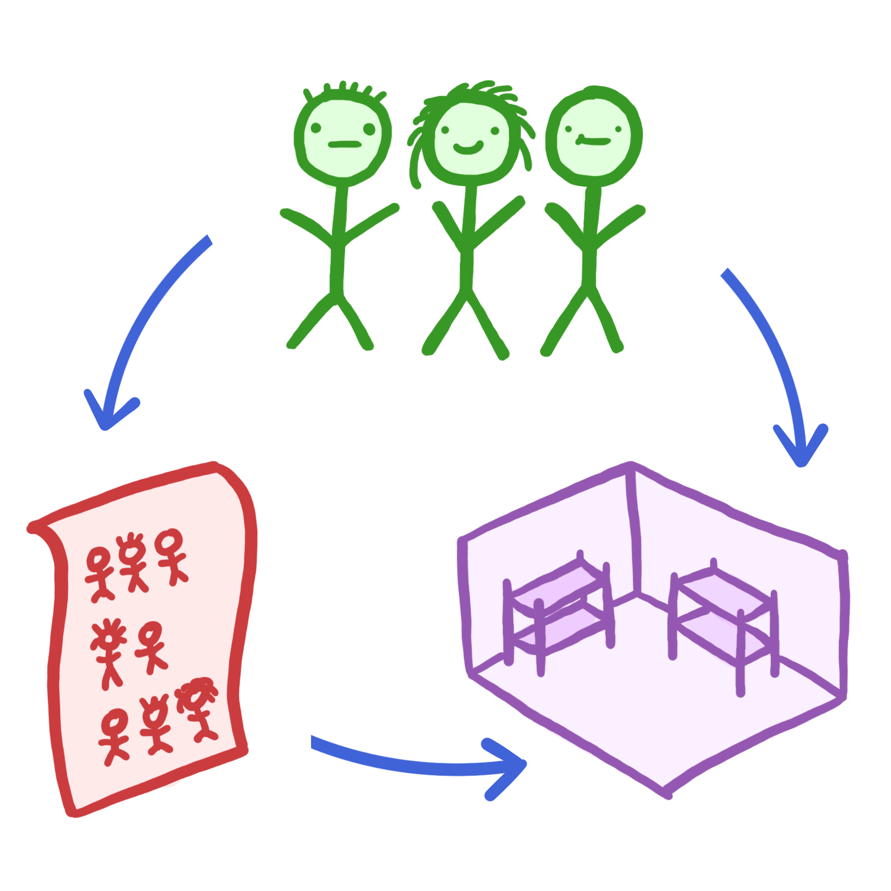

# RoomJuggler
|**Documentation**| **Build Status**|
|---|---|
| [](https://kfrb.github.io/RoomJuggler.jl/stable/) [](https://kfrb.github.io/RoomJuggler.jl/dev/) | [](https://github.com/kfrb/RoomJuggler.jl/actions/workflows/CI.yml?query=branch%3Amain) [](https://codecov.io/gh/kfrb/RoomJuggler.jl) |

A non-registered Julia package to solve a room occupancy problem with simulated annealing

## The room occupancy problem
Guests must be accommodated in rooms separated by gender. Guests can request friends with who they would like to share a room.
**The problem:** How do you allocate the rooms to fulfill as many wishes as possible?

This problem must be solved every year during the Jugendtagorchester rehearsal weekend. See the website <https://www.jugendtag-orchester.de/orchester> if you want to learn more about the orchestra. `RoomJuggler.jl` was written to simplify the room juggling and help the organizers schedule the rooms.

## Installation
For a detailed installation guide, see the documentation: <https://kfrb.github.io/RoomJuggler.jl/stable/>

## Input: Excel file with the data
The excel file needs to contain three sheets: `guests`, `rooms`, and `wishes`:


## Run `RoomJuggler.jl`:

To use `RoomJuggler.jl`, you need just four lines of code:
```julia
using RoomJuggler

# Read the Excel-file and create a `RoomJugglerJob`
# Specify the full path to the file as argument
rjj = RoomJugglerJob("data.xlsx")

# Optimize room occupancy in terms of the guest's happiness
juggle!(rjj)

# Export the results to a new Excel-file
# Specify the name of the resulting file and the RoomJugglerJob as arguments
report("report.xlsx", rjj)
```

The following terminal recording shows how to run `RoomJuggler.jl` on the file [`job_300_guests.xlsx`](https://github.com/kfrb/RoomJuggler.jl/blob/main/examples/job_300_guests.xlsx) in the [`examples`](https://github.com/kfrb/RoomJuggler.jl/blob/main/examples) directory:

[](https://asciinema.org/a/qzUTtlC6goghCcnZzF4R5jvkn?speed=2)

## Output: Excel file with a report
The results of the optimization are exported to an Excel file:

