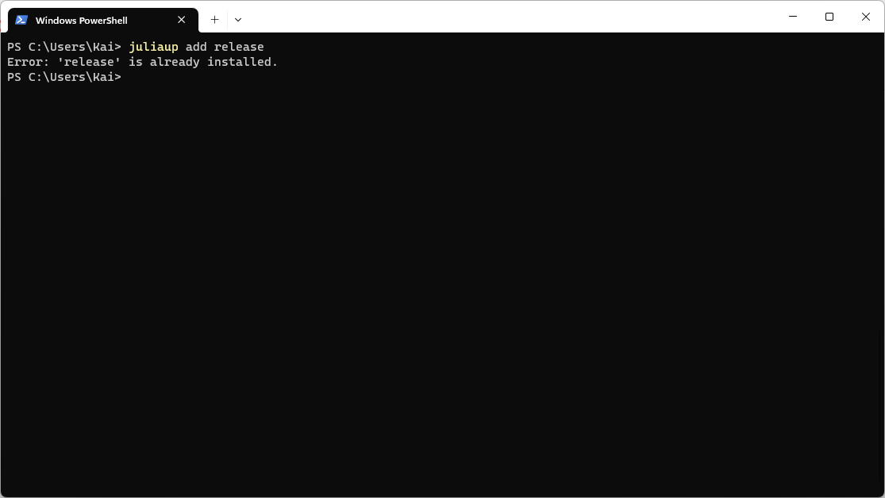

```@raw html

```
# RoomJuggler
Documentation for the non-registered Julia package [`RoomJuggler.jl`](https://github.com/kfrb/RoomJuggler.jl).

**Build Status:**\
[](https://github.com/kfrb/RoomJuggler.jl/actions/workflows/CI.yml?query=branch%3Amain) [](https://codecov.io/gh/kfrb/RoomJuggler.jl)

## The room occupancy problem
Guests must be accommodated in rooms separated by gender. Guests can request friends with who they would like to share a room.
**The problem:** How do you allocate the rooms to fulfill as many wishes as possible?

This problem must be solved every year during the Youth Day Orchestra rehearsal weekend. See the website <https://www.jugendtag-orchester.de/orchester> if you want to learn more about the orchestra. `RoomJuggler.jl` was written to simplify the room juggling and help the organizers schedule the rooms.

## 1. Installation of Julia

To use Julia, we install the Julia-installation manager [`juliaup`](https://github.com/JuliaLang/juliaup).

### Windows
Download & install Julia from the Windows Store: [apps.microsoft.com/store/detail/julia](https://apps.microsoft.com/store/detail/julia/9NJNWW8PVKMN?hl=de-de&gl=de&rtc=1)

### MacOS & Linux
On MacOS and Linux you first have to open the app *Terminal*.
Type in the following command and follow the instructions:
```
curl -fsSL https://install.julialang.org | sh
```

### Check if the installation has worked

Open the app *Windows PowerShell* (Windows) or *Terminal* (MacOS & Linux) and type `juliaup status`. The output the should be similar to the screenshot below.

```
juliaup status
```


!!! note "No release channel"
    If the output of `juliaup status` does not contain a `release` channel, you can add it manually by typing:
    ```
    juliaup add release
    ```

    If everything with the installation is correct, this should return an error:
    

## 2. Installation of `RoomJuggler.jl`
To install, use [Julia's built-in package manager](https://docs.julialang.org/en/v1/stdlib/Pkg/). Open the Julia REPL and type `]` to enter the package mode and install `RoomJuggler.jl` as follows:
```
add https://github.com/kfrb/RoomJuggler.jl
```

## 3. Input: Excel file with the data
First you need to specify the data. The data is stored in an Excel file with the `.xlsx` format. This Excel document must meet the following criteria:
* It has to contain one excel-sheet with the name `guests`. This sheet has to contain one column with the header `name` and one with `gender`, e.g.: 
| name | gender |
|:---|:---|
| Martha Chung | F |
| John Kinder | M |
| Cami Horton | F |
| $\vdots$ | $\vdots$ |
* It has to contain one excel-sheet with the name `rooms`. This sheet has to contain one column with the header `name`, one with `capacity`, and one with `gender`, e.g.: 
| name | capacity | gender |
|:---|:---|:---|
| room 1 | 3 | F |
| room 2 | 4 | F |
| room 3 | 2 | M |
| $\vdots$ | $\vdots$ | $\vdots$ |
* It has to contain one excel-sheet with the name `wishes`. This sheet cannot have headings and has to include the wishes, one line per wish. The first column should be a wish specifier, e.g., an e-mail address. The guests that want to be in the same room are following each in its column, e.g.:
| | | | |
|:---|:---|:---|:---|
| mark.white@test.com | Mark White      | John Kinder | |
| co123@web.com       | Catherine Owens | Cami Horton | Barbara Brown |
| $\vdots$ | | | |


## 4. Run `RoomJuggler.jl`:

To use `RoomJuggler.jl`, you need just four lines of code:
```julia
using RoomJuggler

# Read the Excel-file and create a `RoomJugglerJob`
# Specify the full path to the file as argument
rjj = RoomJugglerJob("data.xlsx")

# Optimize room occupancy in terms of the guest's happiness
juggle!(rjj)

# Export the results to a new Excel-file
# Specify the name of the resulting file and the RoomJugglerJob as arguments
report("report.xlsx", rjj)
```

The following terminal recording shows how to run `RoomJuggler.jl` on the file [`job_300_guests.xlsx`](https://github.com/kfrb/RoomJuggler.jl/blob/main/examples/job_300_guests.xlsx) in the [`examples`](https://github.com/kfrb/RoomJuggler.jl/blob/main/examples) directory:
```@raw html
<script src="https://asciinema.org/a/qzUTtlC6goghCcnZzF4R5jvkn.js" id="asciicast-qzUTtlC6goghCcnZzF4R5jvkn" async data-speed="2"></script>
```

!!! tip "Not all wishes fulfilled"
    Sometimes not all wishes get fulfilled the first time the function `juggle!` is called.
    If that happens, simply re-run the function `juggle!` and optionally specify custom parameters with [`JuggleConfig`](@ref):
    ```julia
    juggle!(rjj; config=JuggleConfig(n_iter=400, beta=0.9999))
    ```

## 5. Output: Excel file with a report
The results of the optimization are exported to an Excel file:


